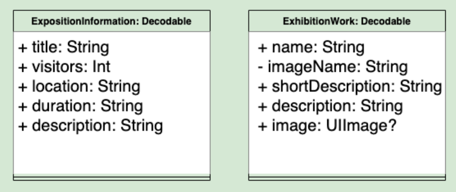
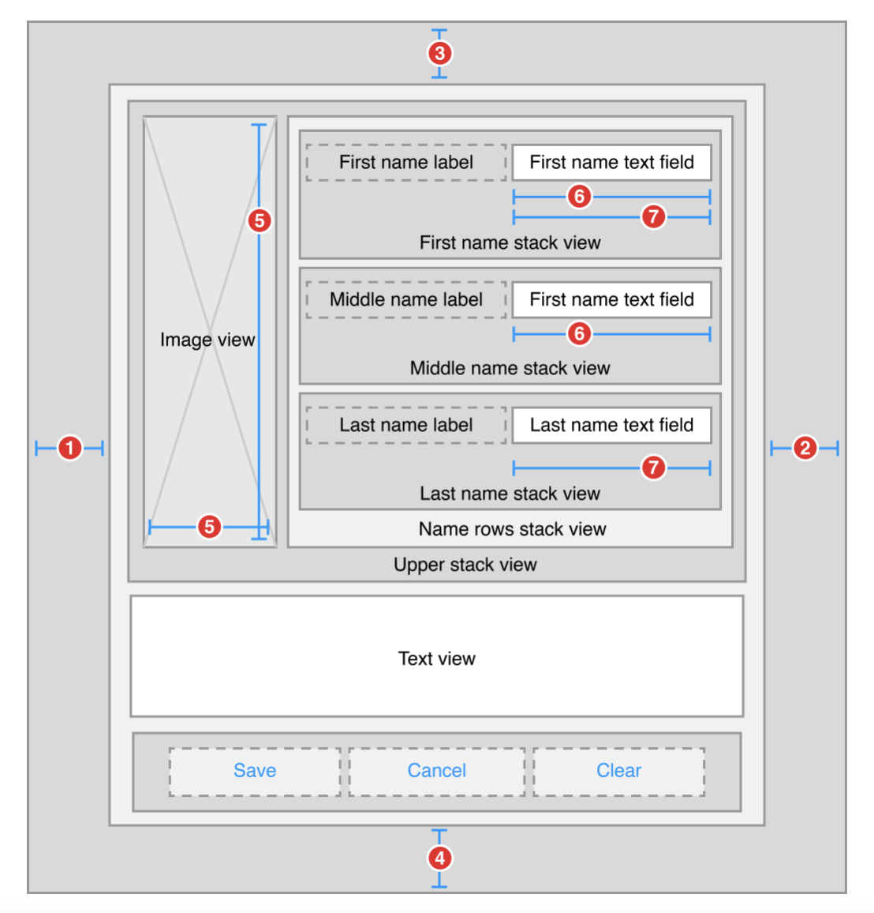
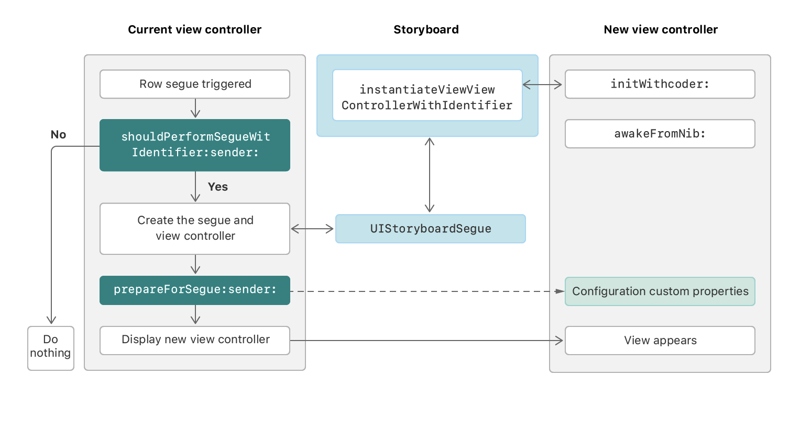
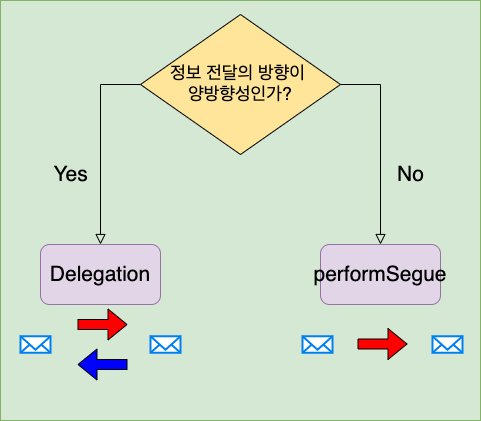

# 🌍 만국박람회 🌍

> <br>만국박람회 소개 및 전시품 목록, 전시품 상세화면을 보여줍니다.<br><br>

|박람회 정보|박람회 전시품 목록|전시품에 대한 상세 정보|
|-|-|-|
||||
## 주요 학습 내용 

- Codable 활용을 통한 JSON데이터와 매칭할 모델 타입 구현
    - [Codable 학습 및 적용 블로그 포스팅 보러가기](https://innieminnie.github.io/codable/jsonencoder/jsondecoder/2021/05/11/Codable.html)
    - [XCTest를 활용하여 JSON데이터와 모델의 매칭 단위테스트 수행](#xctest를-활용하여-json데이터와-모델의-매칭-단위테스트-수행)
- 주어진 JSON 데이터를 파싱하여 테이블뷰에 표시
    - [JSON 데이터를 가져와 테이블뷰에 전시품 목록 표현하기](#json-데이터를-가져와-테이블뷰에-전시품-목록-표현하기)
- 내비게이션 컨트롤러를 통한 화면 전환
    - [Modal과 Navigation의 비교](#화면전환)
- 뷰컨트롤러 간의 정보 전달 방식 비교
    - [performSegue 와 delegate 전달방식의 비교](#thinking-뷰컨트롤러-간의-정보전달-방식에-있어-performsegue와-delegate-중-무엇이-더-적절할까)
- ScrollView
    - [스크롤뷰 학습 블로그 포스팅 보러가기 (1)](https://innieminnie.github.io/scrollview/autolayout/2021/05/20/ScrollView.html)
    - [스크롤뷰 학습 블로그 포스팅 보러가기 (2)](https://innieminnie.github.io/keyboard/uiresponder/uitextfielddelegate/2021/05/24/ScrollViewWithKeyboard.html)
    - [ScrollView 활용](#scrollview-활용)
<br>
---

## 전반적 설계


---
## 화면전환
[H.I.G - Modality](https://developer.apple.com/design/human-interface-guidelines/ios/app-architecture/modality/) & [H.I.G - Navigation](https://developer.apple.com/design/human-interface-guidelines/ios/app-architecture/navigation/)을 참고하여 Modality와 Navigation에 대해 모색해보았습니다.<br>

### Modality 

<b>유저의 기존 context에서 분리시켜 "일시적으로" 새로운 content를 제시하고 해당 content에서 벗어날 수 있는 방식 또한 액션으로 나타내는 디자인 기술</b>

<br>

- <b>iOS에서 제공하는 Modal 제시 방식</b>

    |Alert|Activity View|Action Sheet|
    |:---:|:---:|:---:|
    ||||
    | UIAlertController | UIActivityViewController | UIAlertController.Style.actionSheet |
    | 앱이나 디바이스 상태에 관련된 중요한 정보 전달 및 피드백 요청| 현 context와 연관된 Activity(Copy, Favorite, Find etc.)가 실행될 수 있도록 제안할 경우 | 현 context에서 2가지 이상의 선택권을 제시할 경우|
    - Alerts
        - title, (optional) message, buttons, (optional) text fields 로 구성
        - message 제공 시, 짧고 완전한 문장을 제시한다.
        - 친근한 어조로 사용자에게 안내문을 알린다.
        - alert buttons에 대한 추가설명은 배제한다.
        - 일반적으로 두 개의 버튼을 사용한다(두 가지의 선택권 제공)
        - destructive(취소 또는 해제) 버튼은 명료하게 구분지어 나타낸다.
        - HomeScreen으로 이동 시, alerts 취소가 가능하도록 한다.
        
    - Activity Views
        - 기본 Activities 가 아닌 custom activities를 제시할 경우, '심플한 템플릿 이미지' (흑백 위주 /  적절한 투명도와 해상도 / drop shadow 추가안함) 로 디자인한다.
        - Activity명은 간단명료하게 한다.
        - 현 context와 적절하게 연관이 되는 activities인지 체크한다.
        - Action Button을 통해 Activity View에 접근할 수 있도록 한다.

    - Action Sheets
        - destructive (취소 또는 해제) 작업의 수행 가능성이 있을 경우 '확인' 절차를 요구하기 위해 사용한다.
        - destructive (취소 또는 해제) 작업을 수행하지 않는 방향을 고려하여 'Cancel'버튼을 제공한다.
        - destructive (취소 또는 해제) 작업에 대해 강조한다. (destructive action 관련 버튼의 색을 빨간색으로 설정한다.)
        - action sheet를 스크롤이 가능할 정도로 많은 옵션을 제시하는 것은 지양한다.(옵션의 수를 적게 한다.)
- <b>Custom Modal 제시 방식 (Presentation Style)</b>
    - Sheet
        - '카드' 형식으로 화면을 표시한다.(화면을 부분적으로 커버한다.)
        - 밑에 깔려있는 전환 이전의 화면은 어둑하게 하여 Sheet로 위에 올라온 Modal 영역과 구분짓는다.
        - 전환 이전의 화면 일부를 사용자가 보여줌을 통해 사용자가 현재 보여지는 화면에서 되돌아갈 수 있음을 인지시킨다.
        - '카드' 화면을 내릴 때는 'Swipe down' 이나 'button tap' 방식을 가능케한다.
        - 카드를 popover 위에는 나타내지 않는다.
    <br>
    <p align = center></p>

    - Full Screen
        - 화면 전면을 커버한다.
        - 영상, 사진 등 완전히 화면에 몰입해야 하는 상황에서 사용한다.
        - 버튼을 제공함을 통해 해당 화면에서 벗어날 수 있는 방안을 제시한다.

- <b> Modal Presentation 활용 경험</b><br>
    - 주어진 상황: 로그인 / 회원가입 두 개의 버튼이 있고 회원가입 버튼을 탭할 시, 회원가입 절차에 대한 과정을 진행한다.<br>
    - 구현 내용: 회원가입 flow를 진행하기 위해 로그인 / 회원가입 선택화면에서 화면전환을 Modal로 구현<br>

    ```swift
       @IBAction func touchUpSignUpButton(_ sender: Any) {
          guard let targetController = self.storyboard?.instantiateViewController(identifier: "FirstSignUpViewController") else {
              print("targetController 할당에 문제가 있습니다.")
              return
          }
          targetController.modalPresentationStyle = .fullScreen
          self.present(targetController, animated: true, completion: nil)
      }
    ```
   - 추가 설명: targetController 에 FirstSignUpViewController를 할당한 이후, modalPresentationStyle 설정 및 UIViewController의 present 메소드로 화면을 전환합니다.

### Navigation
<br>
이처럼 상황에 따라 다양한 navigation 형태를 취할 수 있습니다.<br> Navigation 은 modal과 달리 <b>진행의 '흐름'</b> 을 이어가는 형태이고, 화면의 전후관계가 명확하여 navigation을 통해 이전으로 되돌아가거나 흐름을 진행하는 것이 가능합니다.
- 명확한 경로를 제공한다. 사용자가 다음 지점을 어떻게 가야하는지 알 수 있어야한다.
- 흐름의 유동성에 맞는 터치 제스쳐를 사용한다.( 화면이동방향에 맞게 swipe )
- navigation bar에 data의 계층구조를 나타낼 수 있도록 한다. 계층구조 상 현재 위치를 navigation bar의 title에 나타낸다. back button을 통해 이전 위치로 돌아갈 수 있도록 한다.
- 카테고리 사이의 전환에 대해선 tab bar를 활용한다.
<br>

### UINavigationController
- <b>stack 구조</b>를 기반으로 하여 계층적 콘텐츠의 방향을 안내하는 용도의 container view controller

 새로운 ViewController를 <b>push</b> 하고, 이전 화면으로 돌아갈 경우 navigation bar의 back button을 탭함을 통해 현재 화면을 <b>pop</b> 합니다.

 Navigation Controller는 <b>navigation stack</b> 에서 child view controllers를 관리합니다.
 <b>root view controller</b>는 첫 화면, stack의 맨 아래에 있는 view controller를 의미합니다.

 


- 주요 프로퍼티/메서드 정리
    <b>Accessing Items on the Navigation Stack</b>

    |프로퍼티/메서드|타입|설명|
    |---|---|---|
    |var topViewController|UIViewController?|navigation stack의 맨 위에 있는 view controller|
    |var visibleViewController|UIViewController?|현재 보여지는 view와 관련된 view controller|
    |var viewControllers|[UIViewController]|navigation stack내의 view controllers|
    |func setViewControllers([UIViewController], animated: Bool)|-| navigation controller가 관리하는 viewControllers 교체|

    <b>Pushing and Popping Stack Items</b>

    |메서드|설명|
    |---|---|
    |func pushViewController(UIViewController, animated: Bool)|navigation stack에 viewcontroller push 및 디스플레이 교체|
    |func popViewController(animated: Bool) -> UIViewController?|navigation stack에서 viewcontroller pop 및 디스플레이 교체|
    |func popToRootViewController(animated: Bool) -> [UIViewController]?|navigation stack내의 root view controller 제외하고 모두 pop 및 디스플레이 교체|
    |func popToViewController(UIViewController, animated: Bool) -> [UIViewController]?| 특정 view controller가 navigation stack의 top이 될때까지 stack의 view controllers pop|
 
    [UINavigationController관련문서](https://developer.apple.com/documentation/uikit/uinavigationcontroller)

## NavigationController의 활용

> <br>박람회 전체에 대한 정보 -> 해당 박람회에서 보여주는 전시품 목록 -> 전시품에 대한 각각의 구체적 정보<br>
<b>정보의 흐름이 화면이 진행될수록 더 구체화된다</b>는 측면에서 화면전환방식으로 NavigationController를 활용했습니다.<br><br>


---
## Decodable 프로토콜 활용을 통한 JSON데이터와 Swift타입의 매칭
[Codable 학습 및 적용 블로그 포스팅 보러가기](https://innieminnie.github.io/codable/jsonencoder/jsondecoder/2021/05/11/Codable.html)

### Codable 프로토콜이 아닌 Decodable 프로토콜 채택
해당 프로젝트에선 encoding과정이 요구되지 않아, Decodable프로토콜을 채택하여 decoding한 JSON데이터와 구현한 타입을 매칭시켰습니다.

|JSON Data|매칭할 Swift Type|
|:-:|:-:|
|exposition_universelle_1900.json|ExpositionInformation|
|items.json|ExhibitionWork|

<br>

<b>exposition_universelle_1900.json</b>
|Key|설명|
|:-:|:--:|
|title|박람회 이름|
|visitors|박람회 방문자 수|
|location|박람회 장소|
|duration|박람회 개최 기간|
|description|박람회 소개|
<br>

<b>items.json</b>
|Key|설명|
|:-:|:-:|:-:|
|name|전시품 이름|
|image_name|전시품 이미지명|
|short_desc|전시품 요약 설명|
|desc|전시품 설멍|
<br>

### XCTest를 활용하여 JSON데이터와 모델의 매칭 단위테스트 수행
### :thinking: JSON파일에 필요한 Key가 없는 경우?
<b>exposition_universelle_1900.json</b> 의 title을 삭제 후 단위테스트 수행


```swift
struct ExpositionInformation: Decodable {
    let title: String
    let visitors: Int
    let location: String
    let duration: String
    let description: String
    
    private enum CodingKeys: String, CodingKey {
        case title, visitors, location, duration, description
    }
    
    init(from decoder: Decoder) throws {
        let requiredInformations = try decoder.container(keyedBy: CodingKeys.self)
        title = (try requiredInformations.decode(String.self, forKey: .title))
        visitors = (try requiredInformations.decode(Int.self, forKey: .visitors))
        location = (try requiredInformations.decode(String.self, forKey: .location))
        duration = (try requiredInformations.decode(String.self, forKey: .duration))
        description = (try requiredInformations.decode(String.self, forKey: .description))
    }
}
```

```swift
import XCTest
@testable import Expo1900

class Expo1900Tests: XCTestCase {
    private var sut: ExpositionInformation!
    
    override func setUpWithError() throws {
        super.setUp()
        let data = try getData(from: "exposition_universelle_1900")
        sut = try JSONDecoder().decode(ExpositionInformation.self, from: data)
    }
    
    override func tearDownWithError() throws {
        sut = nil
        super.tearDown()
    }
}

extension XCTestCase {
    func getData(from JSONFileName: String) throws -> Data {
        guard let asset = NSDataAsset(name: JSONFileName) else {
            fatalError("Can not found data asset.")
        }
        
        return asset.data
    }
}
```


- keyNotFound 관련 에러를 확인했습니다.

#### (1) try? 를 통해 key값을 발견하지 못할 경우 기본값을 넣어주었습니다.
```swift
init(from decoder: Decoder) throws {
        let requiredInformations = try decoder.container(keyedBy: CodingKeys.self)
        title = (try? requiredInformations.decode(String.self, forKey: .title)) ?? ""
        visitors = (try? requiredInformations.decode(Int.self, forKey: .visitors)) ?? 0
        location = (try? requiredInformations.decode(String.self, forKey: .location)) ?? ""
        duration = (try? requiredInformations.decode(String.self, forKey: .duration)) ?? ""
        description = (try? requiredInformations.decode(String.self, forKey: .description)) ?? ""
    }
```

<br>

### :thinking: Value가 null인 경우엔 어떻게 처리해야할까?
<b>exposition_universelle_1900.json</b> 의 title을 null로 설정한 후 단위테스트 수행


#### (2) 타입의 프로퍼티를 모두 옵셔널로 처리하여 nil값의 가능성을 열어주었습니다.
```swift
struct ExpositionInformation: Decodable {
    let title: String?
    let visitors: Int?
    let location: String?
    let duration: String?
    let description: String?
}
```


<b>디코딩 방식:</b>
 - <b>(1) try? 를 통해 key값을 발견하지 못할 경우 기본값을 넣어주는 방식</b>을 선택했습니다. 

<b> 이유: </b> 
 타입을 생성하는 과정에서 nil 값의 가능성을 열어둘 경우 -> 나중에 뷰에 해당 내용을 표시할 때 nil값의 처리과정이 요구된다.
 
 해당 방식보다 <b>타입의 프로퍼티에 전부 non-optional로 설정</b>하고 뷰에서 처리하기 이전에 디코딩 과정에서 값을 갖거나, 데이터의 값이 없는 경우 기본값으로 처리하여 <b>뷰에선 nil처리에 대해 대응할 필요가 없는 데이터를 대상으로 정보를 표현</b>할 수 있도록 하는 것이 더 적합하다고 판단하였습니다. 

---
## 1) 박람회소개
### ScrollView 활용
<br><br>
- [스크롤뷰 학습 블로그 포스팅 보러가기 (1)](https://innieminnie.github.io/scrollview/autolayout/2021/05/20/ScrollView.html)
- [스크롤뷰 학습 블로그 포스팅 보러가기 (2)](https://innieminnie.github.io/keyboard/uiresponder/uitextfielddelegate/2021/05/24/ScrollViewWithKeyboard.html)
<br>

### :thinking: 스크롤뷰에 담을 UIComponents의 제약사항들을 간략화할 수 없을까?
#### StackView의 활용
<br>

- (1) ScrollView 내에 '박람회의 방문자수, 장소, 기간' 을 나타내는 UILabels를 <b>Vertical StackView</b>
- (2) 하단의 '국가이미지, 박람회 상세 정보를 보기 위한 버튼' 을 <b>Horizontal StackView</b>로 먼저 그룹화 시킨 후,
- (3) 다른 Components 들과 <b>Vertical StackView</b>를 설정했습니다. 
<br>

#### StackView의 Attributes
|Axis<br>(방향)|Alignment<br>(Y축정렬)|Distribution<br>(Arrange Views 의 분배)|Spacing<br>(Arrange Views 간 간격)|
|:-:|:-:|:-:|:-:|
|Horizontal<br>(수평)|Fill<br>(가능한 공간을 최대한 채운다)|Fill<br>(가능한 공간을 최대한 채운다)| 숫자 입력을 통해 설정한다.|
|Vertical<br>(수직)|Leading<br>(Leading쪽으로 정렬)|Fill Equally<br>(각각 동등한 영역을 갖는다)||
||Center<br>(가운데 정렬)|Fill Proportionally<br>(각 view의 intrinsic content size에 기초하여 비율에 따라 공간을 분배한다)||
||Trailing<br>(Trailing쪽으로 정렬)|Equal Spacing<br>(view 간의 간격을 동일하게 한다)||
|||Equal Centering<br>(각 view 의 축에 대한 center 들 간의 간격을 동일하게 한다.||

#### StackView의 효과


[Auto Layout Guide StackView StackViews 관련부분 참고](https://developer.apple.com/library/archive/documentation/UserExperience/Conceptual/AutolayoutPG/LayoutUsingStackViews.html)

위의 이미지 또는 진행한 프로젝트와 같이 UI 의 복잡성이 증가할수록 StackView를 통해 Arranged Subviews를 그룹핑하고 그룹 간의 제약조건만 설정해 줄 수 있음에 따라 제약관계를 간단히 할 수 있었습니다.

#### StackView 사용 시 유의점
여러 View들을 StackView 내부에 배치할 경우, View들이 StackView의 범위를 벗어날 수 있습니다. <br>각 View마다 <b>intrinsic content size</b>를 고려해주어야 하며, 제약조건 충돌이 발생하지 않게 <b>compression resistance priority, hugging priority</b> 를 조정해주어야합니다.

#### StackView와 ScrollView
<br>

- <b>ScrollView</b>와 ScrollView 계층 위에 있는 <b>StackView(ScrollView의 ContentView 역할)</b> 사이에 제약조건을 추가했습니다.
- ScrollView의 <b>FrameLayoutGuide</b>를 통해 <b>스크롤 방향을 수직으로 고정</b>하였고 <b>ContentLayoutGuide</b>를 통해 <b>ScrollView의 Content에 대한 영역</b>에 대한 설정했습니다.

---
## 2) 박람회의 전시품 소개
### JSON 데이터를 가져와 테이블뷰에 전시품 목록 표현하기
<br><br>

```swift
class ExhibitionWorksListViewController: UIViewController {
    @IBOutlet weak var workListTableView: UITableView!
    private var exhibitionWorks = [ExhibitionWork]()

    override func viewDidLoad() {
        super.viewDidLoad()
        decodeExhibitionData()
    }
    
    private func decodeExhibitionData() {
        let assetFile: String = "items"
        guard let asset = NSDataAsset(name: assetFile) else {
            fatalError("Can not found data asset.")
        }
        
        do {
            exhibitionWorks = try JSONDecoder().decode([ExhibitionWork].self, from: asset.data)
        } catch {
            print("error: \(error)")
        }
    }
}
```
|함수명|기능 설명|
|-|-|-|
|decodeExhibitionData|exhibitionWorks(ExhibitionWork의 배열) 에 JSON Data 파싱|

```swift
extension ExhibitionWorksListViewController: UITableViewDataSource {
    func tableView(_ tableView: UITableView, numberOfRowsInSection section: Int) -> Int {
        return exhibitionWorks.count
    }
    
    func tableView(_ tableView: UITableView, cellForRowAt indexPath: IndexPath) -> UITableViewCell {
        guard let cell = tableView.dequeueReusableCell(withIdentifier: "cell") as? ExhibitionWorkTableViewCell else {
            fatalError("error발생")
        }
        
        cell.setUpUI(with: exhibitionWorks[indexPath.row])
        return cell
    }
}

```
UITableViewDataSource(테이블뷰에서 다뤄지는 Data 관련 프로토콜) 프로토콜을 채택하여 관련 메소드를 작성했습니다.

|함수명|기능설명|
|-|-|
|func tableView(_ tableView: UITableView, numberOfRowsInSection section: Int) -> Int| tableview의 section 당 몇개의 row를 배치할 것인가|
- section은 1개이고, section 내에 배치할 row의 갯수는 exhibitionWorks 에 담긴 ExhibitionWork의 갯수 (하나의 row가 하나의 ExhibitionWork 표현) 로 설정하였습니다.

|함수명|기능설명|
|-|-|
|func tableView(_ tableView: UITableView, cellForRowAt indexPath: IndexPath) -> UITableViewCell| tableview의 cell의 생성작업|
- tableView의 dequeueReusableCell (UITableViewCell)을 ExhibitionWorkTableViewCell 타입으로 설정합니다.
- ExhibitionWorkTableViewCell의 setUpUI(with: exhibitionWorks[indexPath.row]) 를 호출합니다. 

```swift
class ExhibitionWorkTableViewCell: UITableViewCell {
    @IBOutlet weak var thumbnailImageView: UIImageView!
    @IBOutlet weak var workNameLabel: UILabel!
    @IBOutlet weak var workDescriptionLabel: UILabel!
    
    override func prepareForReuse() {
        super.prepareForReuse()
        thumbnailImageView.image = nil
        workNameLabel.text = nil
        workDescriptionLabel.text = nil
    }
    
    func setUpUI(with work: ExhibitionWork) {
        thumbnailImageView.image = work.image
        workNameLabel.text = work.name
        workDescriptionLabel.text = work.shortDescription
    }
}

```

|함수명|기능설명|
|-|-|
| override func prepareForReuse()| cell이 reuse queue에 진입하기 이전에 다음 사용을 위해 수행할 작업<br> 사용한 cell에서 표시한 데이터에 대한 초기화작업 진행|
|func setUpUI(with work: ExhibitionWork)| cell의 UIcomponents에 파라미터로 받은 데이터 설정|

---
## 3) 전시품에 대한 상세설명
<br>

### 뷰컨트롤러 사이의 정보 전달
    - 이전 화면에서 특정 cell을 탭할 경우, 해당 전시품에 대한 상세내용을 보여줍니다. 
    - cell에 담긴 전시품에 대한 정보 전달을 위해 delegate 패턴을 활용했습니다.

### :thinking: 뷰컨트롤러 간의 정보전달 방식에 있어 performSegue와 delegate 중 무엇이 더 적절할까?
뷰 컨트롤러 간 정보 전달 방식에 대해 팀원과 함께 고민해봤습니다. ExhibitionWorksListViewController -> ExhibitionWorkDetailViewController 로 화면 전환시, 전시품 정보 전달 방식에 대해 고민해보았습니다.<br>

#### Segue-Based Presentation

```swift
override func prepare(for segue: UIStoryboardSegue, sender: Any?)
```
- segue.destination ( 새로운 뷰컨트롤러 ) 설정
- destination에 필요한 data 전달

```swift
func performSegue(withIdentifier identifier: String, 
           sender: Any?)
```
- identifier: storyboard file 의 수행할 segue identifier
- segue 수행 (화면이동)
<br>

<b>perfomeSegue을 사용하는 경우,</b>
```swift
class ExhibitionWorksListViewController: UIViewController {
    override func prepare(for segue: UIStoryboardSegue, sender: Any?) {
        guard let workDetailViewController = segue.destination as? WorkDetailViewController else {
            return
        }

        if let index = sender as? Int {
            workDetailViewController.workTitle = exhibitionWorks[index].name
            workDetailViewController.workImageData = exhibitionWorks[index].image ?? UIImage()
            workDetailViewController.workDescriptionContents = exhibitionWorks[index].description
            workDetailViewController.navigationItem.title = workDetailViewController.workTitle
        }

    }
}

extension ExhibitionWorksListViewController: UITableViewDelegate {
    func tableView(_ tableView: UITableView, didSelectRowAt indexPath: IndexPath) {
        performSegue(withIdentifier: "showWorkDetailView", sender: indexPath.row)
    }
}
```
정보를 전달하는 뷰컨트롤러(ExhibitionWorkListViewController) 에서 정보를 전달받는 뷰컨트롤러(ExhibitionWorkDetailViewController)를 인지 및 해당 뷰컨트롤러의 프로퍼티에 직접 접근하는 부분을 개선하기 위해 결합도를 낮추는 방향에 대해 고민해보았습니다.<br><br>
<b>Delegation패턴을 활용한 결과,</b>
```swift
class ExhibitionWorksListViewController: UIViewController {
    var delegate: ExpositionWorkDelegate?
}
extension ExhibitionWorksListViewController: UITableViewDelegate {
    func tableView(_ tableView: UITableView, didSelectRowAt indexPath: IndexPath) {
        guard let destinationViewController = self.storyboard?.instantiateViewController(identifier: "exhibitionWork") as? ExhibitionWorkDetailViewController else {
            return
        }
        
        self.delegate = destinationViewController
        delegate?.receive(work: exhibitionWorks[indexPath.row])
        self.navigationController?.pushViewController(destinationViewController, animated: true)
        
        tableView.deselectRow(at: indexPath, animated: true)
    }
}
```
```swift
protocol ExpositionWorkDelegate {
    func receive(work: ExhibitionWork)
}
```
```swift
class ExhibitionWorkDetailViewController: UIViewController {
    @IBOutlet weak var workImageView: UIImageView!
    @IBOutlet weak var workDescriptionLabel: UILabel!
    private var workImage: UIImage?
    private var workDescription: String?
    
    override func viewDidLoad() {
        super.viewDidLoad()
        workImageView.image = workImage
        workDescriptionLabel.text = workDescription
    }
}

extension ExhibitionWorkDetailViewController: ExpositionWorkDelegate {
    func receive(work: ExhibitionWork) {
        workImage = work.image
        workDescription = work.description
        navigationItem.title = work.name
    }
}

```
앞선 방식에 비해 <b>delegate</b>를 설정하는 방식이 정보를 전달하는 뷰컨트롤러와 정보를 전달받는 뷰컨트롤러 간의 <b>결합도를 낮출 수 있다</b>고 생각했습니다. <br>
<b>정보를 전달하는 뷰컨트롤러(ExhibitionWorkListViewController)</b>는 자신의 delegate에게 delegate의 receive 메소드를 수행하라고 알리지만, 해당 delegate에서 실질적으로 recieve메소드 내에서 어떠한 구체적 작업이 수행되는지 알 수 없습니다.<br>
<b>정보를 전달받는 뷰컨트롤러(ExhibitionWorkDetailViewController)</b>는 ExpositionWorkDelegate 프로토콜 채택에 의해 receive 메소드를 작성해주어야하며, 다른 곳에서 자신의 메소드가 호출되면 이에 대한 처리작업만 담당하여 진행합니다. 이로써 자신이 갖고있는 properties 또한 private 하게 접근 제한을 변경하였습니다.<br>
#### 느낀점
이번 프로젝트에서는 delegation 패턴을 활용하는 방식으로 코드를 작성했지만 팀원과 <b>정보 전달의 양방향성</b> 을 기준으로 두 방식을 비교해보았습니다.

<b>정보 전달의 방향이 양방향</b>으로 설정되어 <b>주고받는 행위가 지속적으로 행해지는 경우</b>에는 <b>delegation패턴</b>을, 

해당 프로젝트와 같이 <b>정보 전달 방향이 한쪽으로만 이어질 때</b> (테이블 뷰 셀을 탭할 경우, 해당 전시품에 대한 상세정보를 보여주는 상황)엔 <b>performSegue</b>가 더 적합할 수 있다고 의논해보았습니다.<br>


[해당내용관련 커밋](https://github.com/yagom-academy/ios-exposition-universelle/pull/20)

---
## 트러블슈팅 모아보기
[🤔 JSON파일에 필요한 Key가 없는 경우?](#thinking-json파일에-필요한-key가-없는-경우)
[🤔 Value가 null인 경우엔 어떻게 처리해야할까?](#thinking-value가-null인-경우엔-어떻게-처리해야할까)
[:thinking: 스크롤뷰에 담을 UIComponents의 제약사항들을 간략화할 수 없을까?](#thinking-스크롤뷰에-담을-uicomponents의-제약사항들을-간략화할-수-없을까)
[🤔 뷰컨트롤러 간의 정보전달 방식에 있어 performSegue와 delegate 중 무엇이 더 적절할까?](#thinking-뷰컨트롤러-간의-정보전달-방식에-있어-performsegue와-delegate-중-무엇이-더-적절할까)